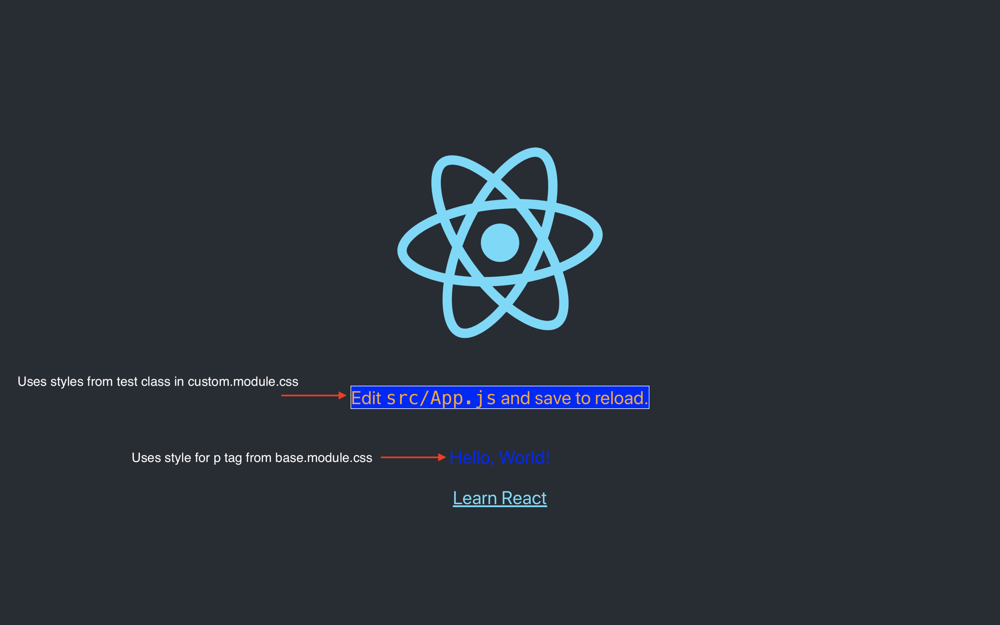

# css_modules_test

This is an example of one possible theming implementation

This is an example of using CSS Modules to allow for custom themes to override base styles

## styles/base.module.css

```css
.App {
  text-align: center;
}

.AppLogo {
  animation: App-logo-spin infinite 20s linear;
  height: 40vmin;
}

.AppHeader {
  background-color: #282c34;
  min-height: 100vh;
  display: flex;
  flex-direction: column;
  align-items: center;
  justify-content: center;
  font-size: calc(10px + 2vmin);
  color: white;
}

.AppLink {
  color: #61dafb;
}

@keyframes App-logo-spin {
  from {
    transform: rotate(0deg);
  }
  to {
    transform: rotate(360deg);
  }
}

.test {
  color: red;
  background-color: blue;
  border: 1px solid green;
}

p {
  color: blue;
}
```

## styles/custom.module.css

```css
.test {
  color: orange;
  background-color: blue;
  border: 1px solid white;
}
```

## styles/index.js

```js
import base from './base.module.css';
import custom from './custom.module.css';

const styles = { ...base, ...custom };

export default styles;
```

## App.js

```jsx
import React, { Component } from 'react';
import logo from './logo.svg';
import styles from './styles';

class App extends Component {
  render() {
    return (
      <div className={styles.App}>
        <header className={styles.AppHeader}>
          
          <p className={styles.test}>
            Edit <code>src/App.js</code> and save to reload.
          </p>
          <p>Hello, World!</p>
          <a
            className={styles.AppLink}
            href="https://reactjs.org"
            target="_blank"
            rel="noopener noreferrer">
            Learn React
          </a>
        </header>
      </div>
    );
  }
}

export default App;
```


